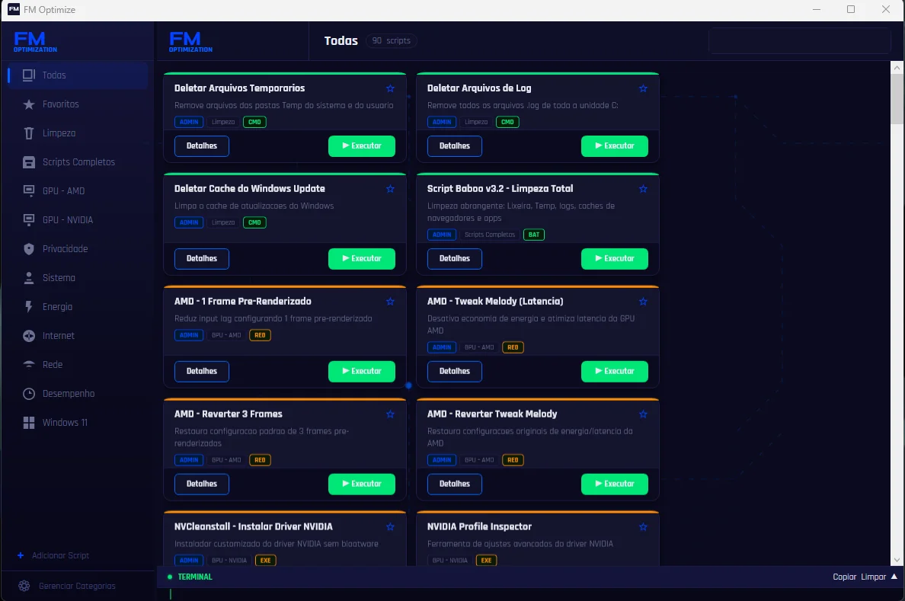
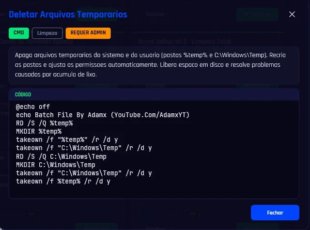
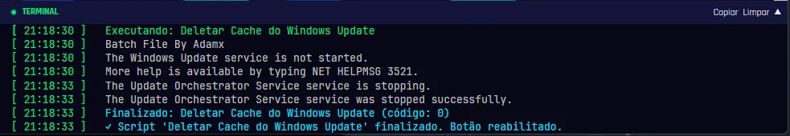
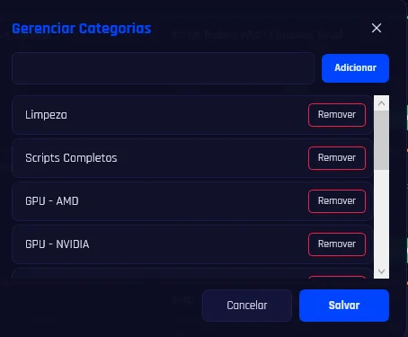
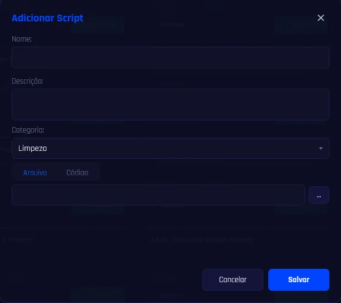

# FM Optimize

**Unifique todos os scripts de otimização do Windows em um só lugar.**

[](https://fmoptimize.vercel.app)

Chega de pesquisar na internet por scripts .bat, .cmd, .reg e .ps1 para cada tarefa de manutenção do sistema. O FM Optimize reúne **90 scripts** essenciais em uma interface gráfica moderna — tudo embutido em um único executável, sem dependências externas.

---

## Índice

- [Visão Geral](#visão-geral)
- [Site](#site)
- [Screenshots](#screenshots)
- [Funcionalidades](#funcionalidades)
- [Scripts Disponíveis](#scripts-disponíveis)
- [Tecnologias](#tecnologias)
- [Como Executar](#como-executar)
- [Publicar Executável](#publicar-executável)
- [Armazenamento dos Scripts](#armazenamento-dos-scripts)
- [Interface do Usuário](#interface-do-usuário)
- [Arquitetura](#arquitetura)
- [Estrutura do Projeto](#estrutura-do-projeto)
- [Troubleshooting / FAQ](#troubleshooting--faq)
- [Roadmap](#roadmap)

---

## Visão Geral

O FM Optimize é um aplicativo desktop (Electron + React) que centraliza **90 scripts de otimização do Windows** em uma interface gráfica moderna com tema escuro azul neon. Os scripts são embutidos diretamente no executável e extraídos automaticamente.

### O que ele faz?

- **Limpeza** — remove arquivos temporários, caches, logs e bloatware
- **Desempenho** — otimiza serviços, inicialização, SSD e jogos
- **Rede** — limpa DNS, reseta TCP/IP, testa latência, bloqueia telemetria
- **Privacidade** — desativa telemetria, Defender, Cortana, Copilot e Windows Update
- **Sistema** — repara arquivos (SFC/DISM), limpa WinSxS, gera relatório
- **GPU AMD/NVIDIA/Intel** — tweaks de latência e instalação limpa de drivers
- **Energia** — ativa planos Ultimate Performance e Alto Desempenho


---

## Site

Acesse o site oficial do FM Optimize em **[fmoptimize.vercel.app](https://fmoptimize.vercel.app)**.

O site é uma landing page responsiva com tema dark neon contendo:
- Visão geral do aplicativo
- Lista de recursos e categorias
- Tecnologias utilizadas
  - Galeria de screenshots
  - Vídeo de demonstração incorporado
  - **Download** das versões portátil e instalável

Os downloads são servidos diretamente via [GitHub Releases](https://github.com/FelipeMeloGomes/FM-Optimization/releases).

---

## Screenshots

<div align="center">
  <a href="assets/screenshots/main.webp"></a>
  <p><em>Janela principal com sidebar, cards de scripts e painel de log</em></p>
</div>

<br>

<div align="center">
  <a href="assets/screenshots/script_details.webp"></a>
  <p><em>Dialog de detalhes de um script com código-fonte e badges</em></p>
</div>

<br>

<div align="center">
  <a href="assets/screenshots/terminal_log.webp"></a>
  <p><em>Terminal com log scrollável, saída ao vivo e botões Copiar/Limpar</em></p>
</div>

<br>

<div align="center">
  <a href="assets/screenshots/new_category.webp"></a>
  <p><em>Dialog de criação de nova categoria personalizada</em></p>
</div>

<br>

<div align="center">
  <a href="assets/screenshots/new_script.webp"></a>
  <p><em>Dialog de edição e adição de scripts por arquivo ou código direto</em></p>
</div>

---

## Funcionalidades

- **Dashboard** — visão geral do sistema: CPU (modelo/núcleos), GPU (modelo/VRAM), Memória (total/tipo DDR), Sistema (OS/versão), Armazenamento (disco primário/total)
- **Restore Points** — criar, listar, restaurar e excluir pontos de restauração do Windows com confirmação e status
- **Settings** — tela de configurações
- **90 Scripts Embutidos** em 11 categorias (Limpeza, Desempenho, Internet, Rede, Privacidade, Sistema, GPU - AMD, GPU - NVIDIA, Energia, Windows 11, Scripts Completos)
- **Tema escuro azul neon** com acentos `#0044ff`, ícones SVG e gradientes
- **Circuito animado no fundo** — traços de PCB com pulsos de dados fluindo (efeito neon)
- **Interface componentizada**: Sidebar, TopBar, ScriptCard, Dashboard, Restore Points, Settings e LogPanel como componentes React independentes
- **Busca instantânea** (Ctrl+F) com glow neon no foco e debounce de 150ms
- **Favoritos**: marque scripts com estrela e filtre rapidamente
- **Log em tempo real** com terminal scrollável, cursor piscante e botões Copiar/Limpar
- **Execução inteligente**: `.bat`, `.cmd`, `.ps1`, `.reg`, `.exe` com detecção de admin
- **Cancelamento**: botão "■ Parar" vermelho substitui o "▶ Executar" durante execução — kill completo da árvore de processos
- **Gerenciamento**: adicione por arquivo ou código direto, edite ou remova scripts e categorias (identificados por ID único)
- **Elevação UAC**: scripts com escudo solicitam admin automaticamente via PowerShell
- **Badges visuais**: cores distintas por tipo de arquivo (BAT=verde, PS1=ciano, EXE/REG=laranja)

---

## Scripts Disponíveis

### Tabela Resumo

Abaixo os 90 scripts disponíveis em 11 categorias.

| # | Nome | Tipo | Admin | Categoria |
|---|------|------|-------|-----------|
| 1 | Deletar Arquivos Temporarios | .cmd | ✓ | Limpeza |
| 2 | Deletar Arquivos de Log | .cmd | ✓ | Limpeza |
| 3 | Deletar Cache do Windows Update | .cmd | ✓ | Limpeza |
| 4 | Script Baboo v3.2 - Limpeza Total | .bat | ✓ | Limpeza |
| 5 | Liberar Memoria RAM | .bat | ✗ | Limpeza |
| 6 | Encerrar Processos Desnecessarios | .bat | ✗ | Limpeza |
| 7 | Limpeza de Navegadores | .bat | ✗ | Limpeza |
| 8 | Limpeza Completa do Sistema | .bat | ✓ | Limpeza |
| 9 | Acelerar Inicializacao | .bat | ✓ | Desempenho |
| 10 | Win32 Priority Separation | .reg | ✓ | Desempenho |
| 11 | Otimizar SSD | .bat | ✓ | Desempenho |
| 12 | Corrigir Erros do Sistema | .bat | ✓ | Desempenho |
| 13 | Otimizar Servicos do Windows | .bat | ✓ | Desempenho |
| 14 | Otimizar Efeitos Visuais | .bat | ✗ | Desempenho |
| 15 | Otimizacao para Jogos | .bat | ✓ | Desempenho |
| 16 | Otimizar DNS e Internet | .bat | ✓ | Rede |
| 17 | Otimizacao TCP/IP Avancada | .bat | ✓ | Rede |
| 18 | Bloquear Telemetria Microsoft | .bat | ✓ | Rede |
| 19 | Resetar Pilha TCP/IP Completa | .bat | ✓ | Rede |
| 20 | Testar Latencia Internet | .bat | ✗ | Rede |
| 21 | Network Reset Completo | .bat | ✓ | Rede |
| 22 | Desabilitar Windows Update | .cmd | ✓ | Privacidade |
| 23 | Desabilitar Windows Defender | .cmd | ✓ | Privacidade |
| 24 | Desabilitar Apps e Instalacao Forcada | .cmd | ✓ | Privacidade |
| 25 | Desabilitar Telemetria e Rastreamento | .bat | ✓ | Privacidade |
| 26 | Desabilitar Cortana e Copilot | .bat | ✗ | Privacidade |
| 27 | Perfect Windows - Otimizacao Completa | .bat | ✓ | Sistema |
| 28 | Debloat - Chris Titus Utility | .txt | ✗ | Sistema |
| 29 | Prioridade CPU/GPU - Registry Guide | .txt | ✗ | Sistema |
| 30 | Limpeza WinSxS e Componentes | .bat | ✓ | Sistema |
| 31 | Relatorio do Sistema | .bat | ✗ | Sistema |
| 32 | AMD - 1 Frame Pre-Renderizado | .reg | ✓ | GPU - AMD |
| 33 | AMD - Tweak Melody (Latencia) | .reg | ✓ | GPU - AMD |
| 34 | AMD - Reverter 3 Frames | .reg | ✓ | GPU - AMD |
| 35 | AMD - Reverter Tweak Melody | .reg | ✓ | GPU - AMD |
| 36 | NVCleanstall - Instalar Driver NVIDIA | .exe | ✓ | GPU - NVIDIA |
| 37 | NVIDIA Profile Inspector | .exe | ✗ | GPU - NVIDIA |
| 38 | Ativar Plano de Energia Ultimate Performance | .bat | ✓ | Energia |
| 39 | Plano de Energia Alto Desempenho | .bat | ✓ | Energia |
| 40 | DNS - Google | .bat | ✓ | Internet |
| 41 | DNS - Cloudflare | .bat | ✓ | Internet |
| 42 | DNS - OpenDNS | .bat | ✓ | Internet |
| 43 | DNS - Quad9 | .bat | ✓ | Internet |
| 44 | DNS - AdGuard | .bat | ✓ | Internet |
| 45 | DNS - Automatico (DHCP) | .bat | ✓ | Internet |
| 46 | Benchmark de DNS | .bat | ✗ | Internet |
| 47 | Flush DNS | .bat | ✓ | Internet |
| 48 | Winsock Reset | .bat | ✓ | Internet |
| 49 | Reset TCP/IP | .bat | ✓ | Internet |
| 50 | Desativar Animacoes do Sistema | .bat | ✗ | Desempenho |
| 51 | Desativar Transparencia do Windows | .bat | ✗ | Desempenho |
| 52 | Desativar SysMain (Superfetch) | .bat | ✓ | Desempenho |
| 53 | Desativar Windows Search | .bat | ✓ | Desempenho |
| 54 | Desativar GameDVR (Gravacao) | .bat | ✗ | Desempenho |
| 55 | Desativar Algoritmo Nagle | .bat | ✓ | Desempenho |
| 56 | Desativar Core Parking | .bat | ✓ | Desempenho |
| 57 | Otimizar Timer do Sistema | .bat | ✓ | Desempenho |
| 58 | Desativar Localizacao | .bat | ✓ | Privacidade |
| 59 | Desativar ID de Anuncio | .bat | ✓ | Privacidade |
| 60 | Desativar Sugestoes no Iniciar | .bat | ✓ | Privacidade |
| 61 | Desativar Timeline | .bat | ✓ | Privacidade |
| 62 | Desativar Conteudo Tela Bloqueio | .bat | ✓ | Privacidade |
| 63 | Desativar Reconhecimento de Fala | .bat | ✓ | Privacidade |
| 64 | Desativar Hibernacao | .bat | ✓ | Energia |
| 65 | Desativar Suspensao Automatica | .bat | ✓ | Energia |
| 66 | Desativar Suspensao USB | .bat | ✓ | Energia |
| 67 | Desativar Economia PCI Express | .bat | ✓ | Energia |
| 68 | Restaurar Menu Classico | .bat | ✓ | Windows 11 |
| 69 | Desabilitar Widgets | .bat | ✓ | Windows 11 |
| 70 | Desabilitar Chat (Teams) | .bat | ✓ | Windows 11 |
| 71 | Desabilitar Barra de Pesquisa | .bat | ✓ | Windows 11 |
| 72 | Desabilitar Snap Layouts | .bat | ✓ | Windows 11 |
| 73 | Desabilitar Copilot | .bat | ✓ | Windows 11 |
| 74 | SFC Scannow | .bat | ✓ | Sistema |
| 75 | DISM RestoreHealth | .bat | ✓ | Sistema |
| 76 | CHKDSK (Verificar Disco) | .bat | ✓ | Sistema |
| 77 | Compactar Sistema Operacional | .bat | ✓ | Sistema |
| 78 | TRIM SSD | .bat | ✓ | Sistema |
| 79 | Relatorio de Bateria | .bat | ✓ | Sistema |
| 80 | Limpeza Profunda do Sistema | .bat | ✓ | Scripts Completos |
| 81 | Limpeza de Disco (CleanMgr) | .bat | ✓ | Limpeza |
| 82 | Limpar Prefetch | .bat | ✓ | Limpeza |
| 83 | Limpar Cache de Miniaturas | .bat | ✗ | Limpeza |
| 84 | Limpar Cache da Windows Store | .bat | ✗ | Limpeza |
| 85 | Limpar Cache DirectX Shader | .bat | ✗ | Limpeza |
| 86 | Limpar Lixeira | .bat | ✗ | Limpeza |
| 87 | Limpar Cache de Atualizacoes | .bat | ✓ | Limpeza |
| 88 | Pacote de Manutencao | .bat | ✓ | Scripts Completos |
| 89 | Turbo Game Mode | .bat | ✓ | Scripts Completos |
| 90 | Privacidade Maxima | .bat | ✓ | Scripts Completos |

### Por Categoria

<details>
<summary><b>Limpeza</b> (15 scripts)</summary>

| # | Nome | Descrição |
|---|------|-----------|
| 1 | **Deletar Arquivos Temporarios** | Remove `%temp%` e `C:\Windows\Temp`, recria pastas e ajusta permissões |
| 2 | **Deletar Arquivos de Log** | Varre toda a unidade C: e deleta todos os arquivos `.log` |
| 3 | **Deletar Cache do Windows Update** | Para serviços de update e limpa a pasta SoftwareDistribution |
| 4 | **Script Baboo v3.2 - Limpeza Total** | Limpeza abrangente: Lixeira, Temp, logs, caches de navegadores e apps |
| 5 | **Liberar Memoria RAM** | Força o Windows a liberar RAM de processos ociosos via `rundllll32` |
| 6 | **Encerrar Processos Desnecessarios** | Finaliza OneDrive, YourPhone, Xbox Game Bar e serviços em 2º plano |
| 7 | **Limpeza de Navegadores** | Fecha Chrome, Edge, Firefox e limpa caches de cada navegador |
| 8 | **Limpeza Completa do Sistema** | Prefetch, Lixeira, logs, cache DNS, .NET, CleanMgr, DISM |
| 81 | **Limpeza de Disco (CleanMgr)** | Abre a ferramenta nativa do Windows para escolher o disco e limpar |
| 82 | **Limpar Prefetch** | Remove arquivos de pré-carregamento do sistema |
| 83 | **Limpar Cache de Miniaturas** | Remove cache de miniaturas do Explorer |
| 84 | **Limpar Cache da Windows Store** | Reseta o cache da Microsoft Store via `wsreset` |
| 85 | **Limpar Cache DirectX Shader** | Remove cache de shaders DirectX |
| 86 | **Limpar Lixeira** | Esvazia a lixeira via linha de comando |
| 87 | **Limpar Cache de Atualizacoes** | Remove cache de atualizações do Windows Update |

</details>

<details>
<summary><b>Desempenho</b> (15 scripts)</summary>

| # | Nome | Descrição |
|---|------|-----------|
| 9 | **Acelerar Inicializacao** | Desativa DiagTrack (telemetria) e SysMain (Superfetch) |
| 10 | **Win32 Priority Separation** | Ajusta prioridade de CPU para foreground (jogos) via registro |
| 11 | **Otimizar SSD** | Executa `defrag /O` e `winsat formal` para forçar TRIM |
| 12 | **Corrigir Erros do Sistema** | Executa SFC + DISM para reparar arquivos corrompidos |
| 13 | **Otimizar Servicos do Windows** | Desabilita 10+ serviços não essenciais (SysMain, Search, Telemetria, etc.) |
| 14 | **Otimizar Efeitos Visuais** | Remove animações, transparência, Aero Peek e reduz timeouts |
| 15 | **Otimizacao para Jogos** | Ativa Game Mode, GPU Scheduling, desativa GameDVR, ajusta latência |
| 50 | **Desativar Animacoes do Sistema** | Remove animações de janelas e menus |
| 51 | **Desativar Transparencia do Windows** | Desliga efeitos de transparência (Aero) |
| 52 | **Desativar SysMain (Superfetch)** | Desativa o serviço de pré-carregamento de aplicativos |
| 53 | **Desativar Windows Search** | Desativa o serviço de busca indexada |
| 54 | **Desativar GameDVR (Gravacao)** | Desativa gravação em segundo plano do Xbox Game Bar |
| 55 | **Desativar Algoritmo Nagle** | Desativa Nagle para reduzir latência de rede |
| 56 | **Desativar Core Parking** | Impede que núcleos de CPU sejam desligados |
| 57 | **Otimizar Timer do Sistema** | Ajusta resolução do timer para 0.5ms |

</details>

<details>
<summary><b>Rede</b> (6 scripts)</summary>

| # | Nome | Descrição |
|---|------|-----------|
| 16 | **Otimizar DNS e Internet** | `flushdns`, `release/renew`, reset TCP/IP + Winsock |
| 17 | **Otimizacao TCP/IP Avancada** | 12 ajustes de rede (RSS, ECN, autotuning, chimney, etc.) |
| 18 | **Bloquear Telemetria Microsoft** | Adiciona 16 domínios de telemetria ao arquivo Hosts |
| 19 | **Resetar Pilha TCP/IP Completa** | Winsock, TCP/IP, DNS, ARP, NetBIOS |
| 20 | **Testar Latencia Internet** | Ping para Cloudflare (1.1.1.1) e Google (8.8.8.8) |
| 21 | **Network Reset Completo** | Reset completo: Winsock, TCP/IP, WinHTTP, Firewall, DNS, adaptadores |

</details>

<details>
<summary><b>Internet</b> (10 scripts)</summary>

| # | Nome | Descrição |
|---|------|-----------|
| 40 | **DNS - Google** | Altera DNS para Google (8.8.8.8 / 8.8.4.4) |
| 41 | **DNS - Cloudflare** | Altera DNS para Cloudflare (1.1.1.1 / 1.0.0.1) |
| 42 | **DNS - OpenDNS** | Altera DNS para OpenDNS (208.67.222.222 / 208.67.220.220) |
| 43 | **DNS - Quad9** | Altera DNS para Quad9 (9.9.9.9 / 149.112.112.112) |
| 44 | **DNS - AdGuard** | Altera DNS para AdGuard (94.140.14.14 / 94.140.15.15) |
| 45 | **DNS - Automatico (DHCP)** | Restaura DNS para automático via DHCP |
| 46 | **Benchmark de DNS** | Testa latência de múltiplos provedores DNS |
| 47 | **Flush DNS** | Limpa cache DNS com `ipconfig /flushdns` |
| 48 | **Winsock Reset** | Reseta a pilha Winsock para configuração padrão |
| 49 | **Reset TCP/IP** | Reseta pilha TCP/IP e metadados de rede |

</details>

<details>
<summary><b>Privacidade</b> (11 scripts)</summary>

| # | Nome | Descrição |
|---|------|-----------|
| 22 | **Desabilitar Windows Update** | Bloqueia atualizações automáticas do Windows e Office via registro |
| 23 | **Desabilitar Windows Defender** | Desliga antivírus, antispyware e proteção em tempo real |
| 24 | **Desabilitar Apps e Instalacao Forcada** | Bloqueia bloatware da Microsoft Store e instalação silenciosa |
| 25 | **Desabilitar Telemetria e Rastreamento** | Desliga DiagTrack, localização, ID de anúncio, bloqueia hosts |
| 26 | **Desabilitar Cortana e Copilot** | Remove Cortana, Copilot, Widgets e busca na web (Bing) |
| 58 | **Desativar Localizacao** | Desativa serviço de localização e sensoriamento |
| 59 | **Desativar ID de Anuncio** | Remove ID de anúncio único do usuário |
| 60 | **Desativar Sugestoes no Iniciar** | Remove sugestões de apps no menu Iniciar |
| 61 | **Desativar Timeline** | Desativa o histórico de atividades e Timeline |
| 62 | **Desativar Conteudo Tela Bloqueio** | Remove dicas e sugestões da tela de bloqueio |
| 63 | **Desativar Reconhecimento de Fala** | Desativa reconhecimento de fala online (Cortana) |

</details>

<details>
<summary><b>Sistema</b> (11 scripts)</summary>

| # | Nome | Descrição |
|---|------|-----------|
| 27 | **Perfect Windows - Otimizacao Completa** | Script interativo com 200+ ajustes em 10 categorias |
| 28 | **Debloat - Chris Titus Utility** | Baixa e executa utilitário online de otimização (`iwr`) |
| 29 | **Prioridade CPU/GPU - Registry Guide** | Guia de caminhos do registro para prioridade em jogos |
| 30 | **Limpeza WinSxS e Componentes** | DISM + Compact para limpar WinSxS e componentes antigos |
| 31 | **Relatorio do Sistema** | Exporta hardware, disco, processos, serviços e bateria para `.txt` |
| 74 | **SFC Scannow** | Verifica e repara arquivos protegidos do sistema |
| 75 | **DISM RestoreHealth** | Repara imagem do Windows com DISM |
| 76 | **CHKDSK (Verificar Disco)** | Verifica integridade do disco com `chkdsk /f` |
| 77 | **Compactar Sistema Operacional** | Compacta arquivos do sistema com Compact OS |
| 78 | **TRIM SSD** | Força operação TRIM em unidades SSD |
| 79 | **Relatorio de Bateria** | Gera relatório detalhado de bateria (`powercfg /batteryreport`) |

> **Nota sobre scripts `.txt`**: scripts com extensão `.txt` (Chris Titus, Registry Guide) são abertos com o bloco de notas, não executados. Use-os como referência ou execute manualmente os comandos.

</details>

<details>
<summary><b>GPU - AMD</b> (4 scripts)</summary>

| # | Nome | Descrição |
|---|------|-----------|
| 32 | **AMD - 1 Frame Pre-Renderizado** | Reduz input lag (1 frame pre-renderizado) |
| 33 | **AMD - Tweak Melody (Latencia)** | 33 ajustes de latência no driver AMD |
| 34 | **AMD - Reverter 3 Frames** | Restaura 3 frames pre-renderizados (padrão) |
| 35 | **AMD - Reverter Tweak Melody** | Restaura configurações originais de energia/latência |

</details>

<details>
<summary><b>GPU - NVIDIA</b> (2 scripts)</summary>

| # | Nome | Descrição |
|---|------|-----------|
| 36 | **NVCleanstall - Instalar Driver NVIDIA** | Instalador customizado sem GeForce Experience e bloatware |
| 37 | **NVIDIA Profile Inspector** | Ferramenta de ajustes avançados do driver NVIDIA |

</details>

<details>
<summary><b>Energia</b> (6 scripts)</summary>

| # | Nome | Descrição |
|---|------|-----------|
| 38 | **Ativar Plano de Energia Ultimate Performance** | Ativa o plano Ultimate Performance (desktops) |
| 39 | **Plano de Energia Alto Desempenho** | Ativa o plano Alto Desempenho |
| 64 | **Desativar Hibernacao** | Desliga hibernação e exclui `hiberfil.sys` |
| 65 | **Desativar Suspensao Automatica** | Impede que o sistema entre em suspensão |
| 66 | **Desativar Suspensao USB** | Impede desconexão de dispositivos USB para economia |
| 67 | **Desativar Economia PCI Express** | Desliga gerenciamento de energia de links PCI Express |

</details>

<details>
<summary><b>Windows 11</b> (6 scripts)</summary>

| # | Nome | Descrição |
|---|------|-----------|
| 68 | **Restaurar Menu Classico** | Restaura menu de contexto clássico do Windows 10 |
| 69 | **Desabilitar Widgets** | Desativa o painel de Widgets do Windows 11 |
| 70 | **Desabilitar Chat (Teams)** | Remove o botão do Chat / Teams da barra de tarefas |
| 71 | **Desabilitar Barra de Pesquisa** | Remove a barra de pesquisa da barra de tarefas |
| 72 | **Desabilitar Snap Layouts** | Desativa o recurso Snap Layouts ao passar o mouse |
| 73 | **Desabilitar Copilot** | Desativa o Microsoft Copilot integrado |

</details>

<details>
<summary><b>Scripts Completos</b> (3 scripts)</summary>

| # | Nome | Descrição |
|---|------|-----------|
| 80 | **Limpeza Profunda do Sistema** | Combina DISM, SFC, CleanMgr, prefetch, temp e logs |
| 88 | **Pacote de Manutencao** | Combina limpeza, reparo de sistema e otimização de disco |
| 89 | **Turbo Game Mode** | Combina 8 otimizações de desempenho para jogos |
| 90 | **Privacidade Maxima** | Combina telemetria, localização, anúncios, Cortana e diagnóstico |

</details>

---

## Tecnologias

| Tecnologia | Finalidade |
|---|---|
| **Electron 35** | Runtime desktop multiplataforma |
| **React 19** | Interface de usuário |
| **TypeScript** | Tipagem estática |
| **Vite (electron-vite)** | Build tool e dev server |
| **Tailwind CSS 4** | Estilização utilitária |
| **shadcn/ui** | Componentes base |
| **React Router 7** | Navegação entre páginas |
| **Lucide React** | Ícones SVG |
| **Node.js** | Processo principal (main process) |
| **Windows API (PowerShell/WMI)** | Detecção de hardware e sistema |

---

## Como Executar

```bash
cd fm-optimize-electron
npm run dev
```

Requires **Node.js** e **npm**. O modo dev abre janela do Electron com hot reload.

Para build de produção:

```bash
npm run build
npx electron-builder --win portable
```

---

## Publicar Executável

### Portátil (standalone)

Gera um único `.exe` standalone sem instalação:

```powershell
cd fm-optimize-electron
npm run build
npx electron-builder --win portable
```

Gera `dist/fm-optimize-*-portable.exe`.

### Instalável (NSIS)

```powershell
cd fm-optimize-electron
npm run build
npx electron-builder --win nsis
```

Gera `dist/fm-optimize-*-setup.exe`. Dados salvos em `%APPDATA%\fm-optimize\`.

---

## Armazenamento dos Scripts

O FM Optimize funciona **sem instalação** — todos os scripts estão embutidos no executável e extraídos automaticamente na inicialização.

### Scripts Embutidos (Built-in)

Os 90 scripts vêm codificados em **Base64** dentro de `resources/scripts.json`. Na inicialização, o Electron via `ScriptRegistryService`:

1. Lê o JSON e decodifica cada `content` (Base64)
2. Extrai os arquivos para `%TEMP%\fm-optimize\scripts\`
3. Executa diretamente do diretório temp quando solicitado

```
┌──────────────────────────────────────────────────────────────┐
│                    fm-optimize.exe                           │
│  ┌────────────────────────────────────────────────────────┐  │
│  │              resources/scripts.json                     │  │
│  │  ┌──────────────────────────────────────────────────┐  │  │
│  │  │ 90 entradas com name, category, extension,       │  │  │
│  │  │ requiresAdmin, content (Base64)                  │  │  │
│  │  └──────────────────────────────────────────────────┘  │  │
│  │                       │                                 │  │
│  │                       ▼                                 │  │
│  │  ┌──────────────────────────────────────────────────┐  │  │
│  │  │  ScriptRegistryService.extractScript()            │  │  │
│  │  │  └─ Buffer.from(base64, 'base64') + sanitiza     │  │  │
│  │  │     (remove pause) + salva em disco               │  │  │
│  │  └──────────────────────────────────────────────────┘  │  │
│  └──────────────────────────────────────────────────────┘   │
│                       │                                      │
│                       ▼                                      │
│  %TEMP%\fm-optimize\scripts\                              │
│  ├── 1 Delete Temporary Files.cmd                            │
│  ├── Liberar Memoria RAM.bat                                 │
│  ├── Desabilitar Telemetria.bat                              │
│  ├── NVCleanstall_1.19.0.exe                                 │
│  └── ... (90 arquivos)                                       │
└─────────────────────────────────────────────────────────────┘
```

- Scripts são **sempre reextraídos** na inicialização
- Na extração, linhas com `pause` ou `pause >nul` são **removidas automaticamente**
- O diretório `%TEMP%` é limpo pelo Windows periodicamente

### Scripts do Usuário

Além dos embutidos, o usuário pode adicionar scripts próprios:

1. Abre o diálogo "Editar Script" → "Selecionar Arquivo" ou cole o código diretamente
2. Escolhe qualquer `.bat`, `.cmd`, `.ps1`, `.reg` ou `.exe`
3. O **caminho absoluto** é salvo em `scripts_data.json`

```
FMOptimize.exe/
├── scripts_data.json          ◄── ao lado do executável
├── user_scripts/              ◄── scripts criados via código
│   ├── MeuScript.bat
│   └── ...
```

**scripts_data.json**:
```json
{
  "Categorias": ["Limpeza", "Desempenho", "Internet", "Rede", "Privacidade", "Sistema", "GPU - AMD", "GPU - NVIDIA", "Energia", "Windows 11", "Scripts Completos"],
  "Favoritos": ["Liberar Memoria RAM"],
  "Scripts": [
    { "Nome": "Meu Script", "Descricao": "...", "Categoria": "Desempenho", "Caminho": "D:\\scripts\\otimizar.bat", "Tipo": ".bat" }
  ]
}
```

### Resumo dos Caminhos

| Tipo | Onde fica | Definido em |
|---|---|---|
| **Scripts embutidos** | `%TEMP%\fm-optimize\scripts\` (sempre reextraídos) | ScriptRegistryService.extractScript() |
| **Dados do app** | `%APPDATA%\FMOptimize\` (packaged) ou `data/` (dev) | `DataService.getStoragePath()` |
| **Scripts do usuário (arquivo)** | Qualquer lugar no disco | Escolhido pelo usuário no `OpenFileDialog` |
| **Scripts do usuário (código)** | `{BaseDirectory}\user_scripts\` | Definido pelo nome salvo |

---

## Interface do Usuário

### Layout Principal

A interface é dividida em sidebar (200px) + conteúdo principal, navegando entre seções:

```
┌──────────┬───────────────────────────────────────────┐
│          │  Dashboard / Restore Points / Settings     │
│  Sidebar │  ou                                        │
│          │  TopBar (título + badge + busca)           │
│  Categor │  ScriptCards (WrapPanel)                   │
│  ias     │  ● Fade-in + scale animados                │
│  com     │  ● Badges de tipo e admin                  │
│  ícones  │  ● Estrela de favorito                     │
│  SVG     │  ● Botão Executar / Parar                  │
│          │────────────────────────────────────────────│
│  [Novo]  │  LogPanelControl                           │
│  [Geren] │  (terminal scrollável + Copiar/Limpar)     │
│          │                                            │
│ ──────── │                                            │
│ Config   │                                            │
└──────────┴───────────────────────────────────────────┘
```

### Componentes

| Componente | Arquivo | Descrição |
|---|---|---|
| **Sidebar** | `src/layout/Sidebar.tsx` | Logo FM/OPTIMIZATION pulsante, navegação entre páginas com ícones Lucide |
| **TopBar** | `src/layout/TopBar.tsx` | Título da página + badge de contagem, campo de busca |
| **ScriptCard** | `src/components/ScriptCard.tsx` | Card com nome, descrição, badges (ADMIN, tipo), botões Executar/Parar, estrela de favorito |
| **DashboardWidget** | `src/components/DashboardWidget.tsx` | Widget de info do sistema (CPU, GPU, RAM, disco, OS) |
| **LogPanel** | `src/components/LogPanel.tsx` | Terminal com log em fonte monospace, botões Copiar/Limpar |
| **CircuitBackground** | `src/components/CircuitBackground.tsx` | Fundo animado canvas — grid PCB com pulsos de dados |

### Dialogs

| Dialog | Arquivo | Descrição |
|---|---|---|
| **Detalhes do Script** | `src/components/ScriptDetailDialog.tsx` | Exibe nome, descrição detalhada, código-fonte e badges |
| **Adicionar Script** | `src/components/EditScriptDialog.tsx` | Formulário para adicionar novo script |

### Atalhos de Teclado

| Tecla | Ação |
|---|---|
| `Ctrl+F` | Foca o campo de busca |
| `Esc` | Limpa o campo de busca |

---

## Arquitetura

### Fluxo de Inicialização

```
electron/main/index.ts
  │
  ├─ mainWindow (BrowserWindow)
  │   ├─ preload (contextBridge)
  │   └─ loadRenderer (react-router)
  │
  └─ registerIpcHandlers()
       │
       ├─ ScriptRegistryService (loadScripts, getScriptContent)
       ├─ SystemInfoService (getSystemInfo — WMI/PowerShell)
       ├─ ScriptExecutionService (executeScript, cancelExecution)
       ├─ RestorePointService (getRestorePoints, create, delete, restore)
       ├─ DataService (loadSettings, saveSettings)
       └─ AdminCheck (isAdmin — net session)
```

### Fluxo de Execução de Script

```
Render: ScriptsPage → ScriptCard → "▶ Executar"
    │
    └─ useScriptContext().execute(id)
         │
         └─ window.electronAPI.executeScript(id)
              │
              └─ ipcMain.handle('execute-script')
                   │
                   └─ ScriptExecutionService.execute()
                        │
                        ├─ .bat/.cmd → cmd.exe /c "<caminho>"
                        ├─ .ps1 → powershell.exe -ExecutionPolicy Bypass -File "<caminho>"
                        ├─ .reg → regedit.exe /s "<caminho>"
                        └─ .exe → execução direta
                             │
                             └─ child_process.spawn()
                                  ├─ stdout/stderr → IPC → LogContext (tempo real)
                                  └─ cancelamento via process.kill(tree: true)
```

### Fluxo de Extração de Scripts

```
ScriptRegistryService.getResourcesPath()
    │
    ├─ Dev:  resolve("resources/scripts.json")
    └─ Prod: path.join(process.resourcesPath, "scripts.json")
         │
         └─ extractScript()
              │
              ├─ Buffer.from(entry.content, 'base64')
              ├─ Sanitiza: remove linhas "pause" e "pause >nul"
              └─ Salva em %TEMP%\fm-optimize\scripts\
```

### Camadas do Projeto

```
electron/ (main process)
├─ main/index.ts        → Entry point, window creation, lifecycle
├─ main/ipc-handlers.ts → Registro de handlers (ipcMain.handle)
├─ main/services/       → ScriptRegistryService, SystemInfoService,
│                          ScriptExecutionService, RestorePointService,
│                          DataService, AdminCheck
├─ preload/index.ts     → contextBridge (ElectronAPI tipada)
└─ shared/ipc-types.ts  → Interfaces compartilhadas (tipos IPC)

src/ (renderer)
├─ main.tsx             → Entry point React
├─ App.tsx              → Providers + Router
├─ layout/              → AppLayout (sidebar + topbar + outlet + log)
├─ pages/               → DashboardPage, ScriptsPage, RestorePointsPage, SettingsPage
├─ contexts/            → ScriptContext, SystemContext, RestorePointContext,
│                          LogContext, SettingsContext
├─ components/          → ScriptCard, DashboardWidget, LogPanel, FavoriteButton,
│                          SearchInput, CircuitBackground, ScriptDetailDialog, EditScriptDialog
├─ lib/utils.ts         → cn() utility (tailwind-merge + clsx)
└─ styles/globals.css   → Tema Tailwind v4 (@theme + @layer)
```

---

## Estrutura do Projeto

```
FM-Scripts/
├── AGENTS.md                             # Instruções de build para agente
├── README.md                             # Esta documentação
├── assets/                               # Screenshots
│
├── fm-optimize-electron/                 # Aplicação Electron
│   ├── package.json                      # Dependências e scripts
│   ├── electron.vite.config.ts           # Configuração do Vite
│   ├── electron-builder.yml              # Configuração do electron-builder
│   ├── tsconfig.json / .node.json / .web.json  # TypeScript configs
│   ├── index.html                        # HTML entry point
│   │
│   ├── resources/
│   │   ├── icon.ico                      # Ícone do executável
│   │   └── scripts.json                  # 90 scripts em Base64
│   │
│   ├── electron/ (main process)
│   │   ├── main/
│   │   │   ├── index.ts                  # Entry point, window creation
│   │   │   ├── ipc-handlers.ts           # Registro de handlers IPC
│   │   │   └── services/
│   │   │       ├── script-registry.ts    # Load, decode, extract scripts
│   │   │       ├── system-info.ts        # WMI via PowerShell
│   │   │       ├── script-executor.ts    # Spawn processos
│   │   │       ├── restore-points.ts     # PowerShell Checkpoint-Computer
│   │   │       ├── data-service.ts       # Persistência JSON
│   │   │       └── admin-check.ts        # isAdmin check
│   │   ├── preload/
│   │   │   └── index.ts                  # contextBridge
│   │   └── shared/
│   │       └── ipc-types.ts              # Interfaces compartilhadas
│   │
│   └── src/ (renderer)
│       ├── main.tsx                       # Entry point React
│       ├── App.tsx                        # Providers + Router
│       ├── layout/
│       │   ├── AppLayout.tsx              # Shell (sidebar + topbar + outlet + log)
│       │   ├── Sidebar.tsx                # Navegação lateral
│       │   └── TopBar.tsx                 # Busca e ações
│       ├── pages/
│       │   ├── DashboardPage.tsx          # Visão geral do sistema
│       │   ├── ScriptsPage.tsx            # Grid de scripts
│       │   ├── RestorePointsPage.tsx      # Gerenciar restore points
│       │   └── SettingsPage.tsx           # Preferências
│       ├── contexts/
│       │   ├── ScriptContext.tsx           # Estado de scripts
│       │   ├── SystemContext.tsx           # Estado do sistema
│       │   ├── RestorePointContext.tsx     # Estado de restore points
│       │   ├── LogContext.tsx              # Log em tempo real
│       │   └── SettingsContext.tsx         # Configurações
│       ├── components/
│       │   ├── ScriptCard.tsx              # Card de script
│       │   ├── ScriptCardSkeleton.tsx      # Skeleton loader
│       │   ├── DashboardWidget.tsx         # Widget de dashboard
│       │   ├── LogPanel.tsx                # Terminal scrollável
│       │   ├── FavoriteButton.tsx          # Botão favorito
│       │   ├── SearchInput.tsx             # Campo de busca
│       │   ├── CircuitBackground.tsx       # Fundo animado (canvas)
│       │   ├── ScriptDetailDialog.tsx      # Detalhes do script
│       │   └── EditScriptDialog.tsx        # Adicionar/editar script
│       ├── lib/
│       │   └── utils.ts                    # cn() utility
│       └── styles/
│           └── globals.css                 # Tema Tailwind v4
│
└── FMOptimize.Tests/                   # (a migrar — testes C# antigos)
```

---

## Troubleshooting / FAQ

### "O aplicativo não abre"

O app detecta automaticamente se está rodando como administrador. Scripts marcados como "Requer Admin" só executam com privilégios elevados. O sistema solicitará UAC quando necessário.

### "Meu script não executa"

Verifique:
- O tipo do arquivo é suportado (`.bat`, `.cmd`, `.ps1`, `.reg`, `.exe`, `.txt`)
- O script `.txt` é apenas aberto no bloco de notas, não executado
- Scripts marcados como "Admin" (ícone de escudo) exigem que o app rode como administrador

### "Onde estão meus scripts do usuário?"

Os dados ficam em `%APPDATA%\FMOptimize\` (ou `data/` em modo dev). Os scripts embutidos ficam em `%TEMP%\fm-optimize\scripts\`.

### "Como resetar tudo?"

Delete os arquivos abaixo e reinicie o aplicativo:
```
%TEMP%\fm-optimize\
%APPDATA%\fm-optimize\
```

### "O log está muito grande"

O log mantém no máximo **500 entradas** na tela. Use o botão "Limpar" (ícone de lixeira) para limpar manualmente.

### "Como recuperar um script que removi?"

Scripts embutidos (built-in) são recarregados automaticamente do `resources/scripts.json`. Scripts do usuário removidos não podem ser recuperados — a menos que você tenha backup dos dados.

---

## Roadmap

- [ ] **Agendamento de tarefas** — executar scripts em horário agendado
- [ ] **Perfis de otimização** — combinar múltiplos scripts em um único clique
- [ ] **Relatório de impacto** — mostrar o que cada script altera antes de executar

---

<div align="center">
  <sub>FM Optimize — Feito por <a href="https://github.com/anomalyco">Felipe Melo</a></sub>
</div>
