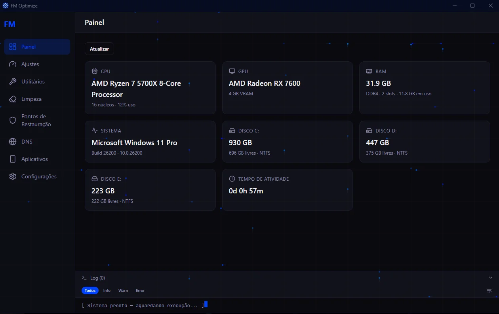
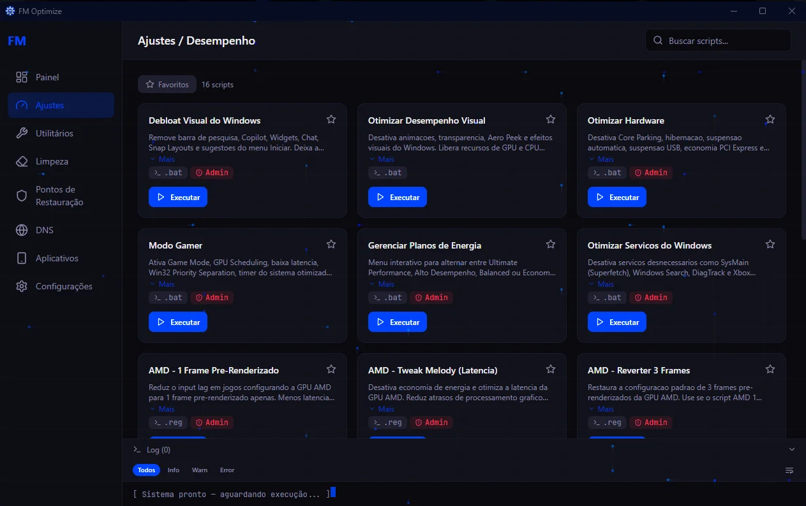
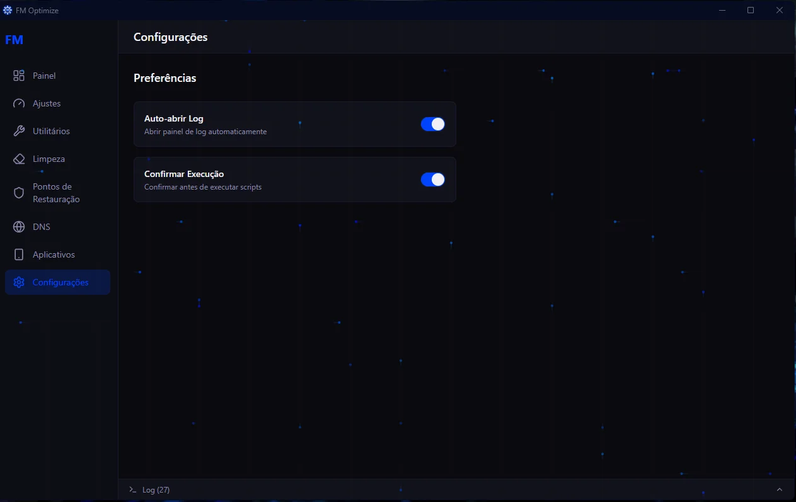
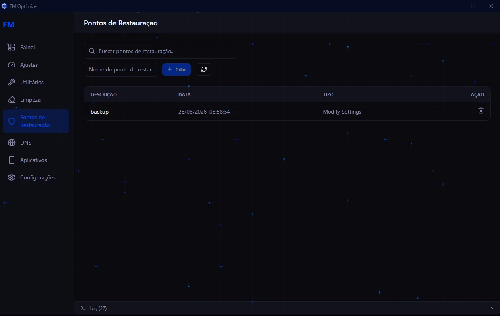

# FM Optimize

[](https://fmoptimize.vercel.app)

41 scripts de otimização do Windows em um único app desktop. Tudo embutido em um executável.

---

<div align="center">
  
</div>

<br>

<div align="center">
  <table>
    <tr>
      <td width="50%"></td>
      <td width="50%"></td>
    </tr>
    <tr>
      <td width="50%"></td>
      <td width="50%"></td>
    </tr>
  </table>
</div>

---

## Funcionalidades

- **Dashboard** — CPU, GPU, memória, armazenamento com barra de uso e tempo de atividade
- **Scripts de otimização** — Tweaks, Utilitários, Limpeza, Rede, Apps, Input Lag, Processador (Intel/AMD)
- **Armazenamento** — Limpeza de Disco do Windows e otimizações de SSD que só aparecem quando há um SSD detectado no sistema
- **Rede** — benchmark de DNS com ordenação por latência e aplicação automática + scripts de otimização de internet
- **Limpeza** — limpeza de arquivos temporários, cache de navegadores e atualizações do Windows
- **Processador** — detecção automática de fabricante (Intel/AMD) com scripts específicos
- **Restore Points** — crie, liste, gerencie e restaure backups do Windows (criação automática opcional antes de executar scripts)
- **Histórico de Execução** — registro de todos os scripts executados com duração e status
- **Mini-guia** — explicação simples do que cada script faz e quando usar
- **Atualização integrada** — botão nas Configurações que baixa e instala novas versões do GitHub
- **Janela customizada** — controles de minimizar/fechar customizados, sem barra de título nativa do Windows
- **Tema** — dark azul neon com fundo de circuito animado

---

## Tecnologias

Electron 35 · React 19 · TypeScript · Vite · Tailwind CSS 4 · Framer Motion

---

## Segurança

O app executa comandos PowerShell no sistema. Todo dado que entra via IPC é validado (Zod) e passa por rate-limit antes de tocar o sistema. Comandos usam argumentos parametrizados e escapados (`psEscape`) para bloquear injeção. A elevação de privilégios usa allowlist de scripts e revalidação de argumentos. Veja `fm-optimize-electron/docs/SECURITY.md`.

---

## Início rápido

```bash
cd fm-optimize-electron
npm install
npm run dev     # desenvolvimento
npm run build   # produção (gera em out/)
```

---

## Download

[fmoptimize.vercel.app](https://fmoptimize.vercel.app) · [GitHub Releases](https://github.com/FelipeMeloGomes/FM-Optimization/releases)

---

## Para desenvolvedores

Documentação técnica em `fm-optimize-electron/docs/`:

- [ARCHITECTURE.md](fm-optimize-electron/docs/ARCHITECTURE.md) — camadas, fluxo IPC, providers modulares
- [SECURITY.md](fm-optimize-electron/docs/SECURITY.md) — controles de segurança e modelo de ameaça
- [DEVELOPMENT.md](fm-optimize-electron/docs/DEVELOPMENT.md) — setup, scripts, convenções, como adicionar handlers IPC

```bash
cd fm-optimize-electron
npm install
npm run dev      # desenvolvimento
npm run build    # produção (out/)
npm test         # testes do main process (Vitest)
```
